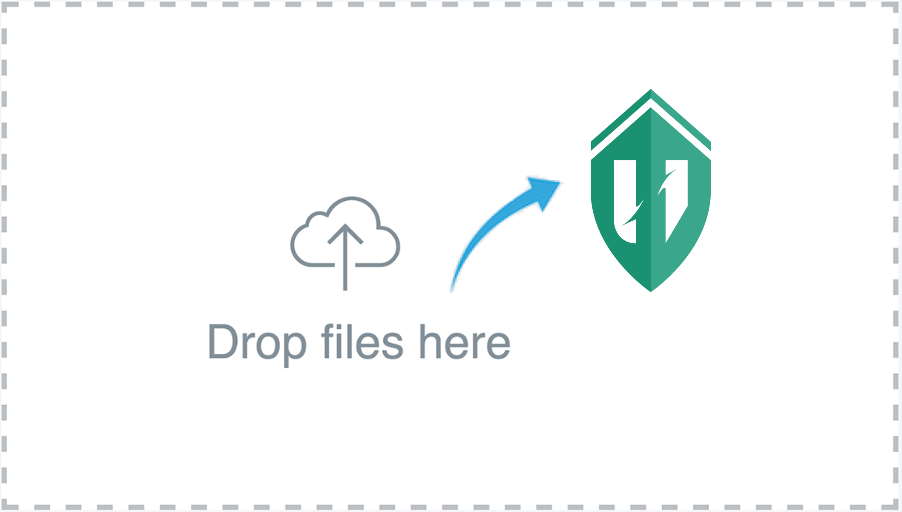
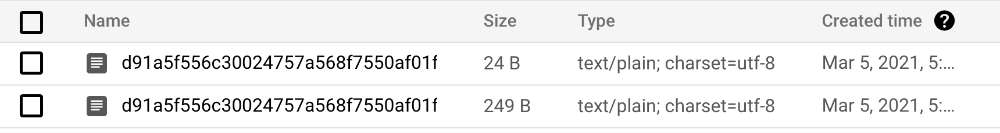

# Up- and download files using tus protocol



## What is tus und why using it at all?

Sooner or later every developer bumps into a project where there is a task to deal with online documents. If there is a suitable library in the framework at hand, they grab it which is of course advisable. But if there isn't, many might say: "It cannot be as difficult. Just use HTTP or FTP and have fun." 

The fun wears off, if the internet connection gets broken, or the product owner suddenly wants to pause the upload process, or the infrastructure moves from one cloud provider to another, or there is more than one programming language on the client side etc.

I decided to rely on the professionals who knows how to setup the process efficiently and my choice fell on the [tus project](https://tus.io/). It promised everything I needed:

- _stability_ even if the internet connection is unstable
- _freedom_ where to deploy the service, be it on my own virtual machine or on Google Cloud or AWS
- _responsiveness_ while uploading the file
- _security_ is admittedly not out of the box, but it is possible to inject it where necessary
- _documentation_ and _examples_ in different programming languages

## Scope of this article

In this article we start with the [official example in Go](https://github.com/tus/tusd/blob/master/docs/usage-package.md) and proceed with the following steps:

- adopt the example for using it with the Google Cloud
- inject a JWT check
- create a metadata for a file
- create a Java client

## The official Tus example in Go

Let's start with creating _main.go_ like we have it in the official example on [github.com](https://github.com/tus/tusd/blob/master/examples/server/main.go). Since we want to code, I get rid of the comments.

```go
package main

import (
    "fmt"
    "net/http"

    "github.com/tus/tusd/pkg/filestore"
    tusd "github.com/tus/tusd/pkg/handler"
)

func main() {
    store := filestore.FileStore{ Path: "./uploads" }

    composer := tusd.NewStoreComposer()
    store.UseIn(composer)

    handler, err := tusd.NewHandler(tusd.Config{
        BasePath:              "/files/",
        StoreComposer:         composer,
        NotifyCompleteUploads: true,
    })
    if err != nil {
        panic(fmt.Errorf("Unable to create handler: %s", err))
    }

    go func() {
        for {
            event := <-handler.CompleteUploads
            fmt.Printf("Upload %s finished\n", event.Upload.ID)
        }
    }()

    http.Handle("/files/", http.StripPrefix("/files/", handler))
    err = http.ListenAndServe(":8080", nil)
    if err != nil {
        panic(fmt.Errorf("Unable to listen: %s", err))
    }
}
```

We make this code executable and test it briefly:

```bash
> mkdir -p uploads
> go mod init
> go run .
> echo "this is my owesome data" > test.txt
> curl -i -XPOST http://localhost:8080/files/ \
    --data-binary "@test.txt" \
    -H "Tus-Resumable: 1.0.0" \
    -H "Upload-Offset: 0" \
    -H "Upload-Length: 24" \
    -H "Content-Type: application/offset+octet-stream"
HTTP/1.1 201 Created
Location: http://localhost:8080/files/dd6c76437675c9d3c40b02cfcdfec3b7
Tus-Resumable: 1.0.0
Upload-Offset: 24
X-Content-Type-Options: nosniff
Date: Fri, 05 Mar 2021 16:14:47 GMT
Content-Length: 0
```

As you can see we created the folder _uploads_ because it is what we have as a store in the code:

```go
store := filestore.FileStore{ Path: "./uploads" }
```

_curl_ in our example receives several headers that are a bare minimum and essential for the successful upload.

Now you will find two files under _./uploads_: one with the original content and another with the extension _.info_ and the metadata:

```bash
24  5 Mar 16:45 dd6c76437675c9d3c40b02cfcdfec3b7
236  5 Mar 16:45 dd6c76437675c9d3c40b02cfcdfec3b7.info
```

You also can download the file with _curl_ back to the original place. Just use the header _Location_ you have got with the response after uploading the file:

```bash
> curl http://localhost:8080/files/dd6c76437675c9d3c40b02cfcdfec3b7 > test-downloaded.txt
> cat test-downloaded.txt
this is my owesome data
```

That was simple enough, wasn't it?

## Uploading files to the Google Cloud

Now we adopt the example to upload the files to the Google Cloud. I assume that you are familiar with the basic Cloud concepts and omit the part with getting access to it. You need at least a service account key with the permission to read and write files to the bucket. Let us assume you have generated this key and saved it into the file _google-credentials.json_ Put this filename into the environment variable in _main.go_ and create the client to operate with the bucket:

```go
import (
    ...
    "os"
    "cloud.google.com/go/storage"
    "github.com/tus/tusd/pkg/gcsstore"
)

func main() {

    os.Setenv("GOOGLE_APPLICATION_CREDENTIALS", "./google-credentials.json")

    ctx := context.Background()
    client, err := storage.NewClient(ctx)
    if err != nil {
        panic(err)
    }

    defer func() {
        if err := client.Close(); err != nil {
            fmt.Println(err)
        }
    }()

...
}
```

We also need to replace the _filestore_ with _gcsstore_:

~~store := filestore.FileStore{ Path: "./uploads" }~~

```go
store := gcsstore.New("my-bucket", &gcsstore.GCSService{
    Client: client,
})
```

For the purpose of simplicity create _my-bucket_ through the Google Console like we did it with the folder _./uploads_. It must exist before we start testing.

That is all! Let us try again with the same _curl -XPOST_ we tried earlier and see that it works (assuming your cloud key and bucket are intact)



## JWT check

I consider it a better architecture pattern to delegate the JWT check to the API Gateway. However, it is not always possible and not the only right way to authorise a request. Let's see how to do it in our Go program.

Tus package has a convenient way to integrate a middleware in an HTTP handler. We are going to use it for checking the header _Authorization_.

~~http.Handle("/files/", http.StripPrefix("/files/", handler))~~

```go
customHandler := http.StripPrefix("/files/", handler)
handler.Middleware(customHandler)

http.Handle("/files/", http.HandlerFunc(func(w http.ResponseWriter, req *http.Request) {
    err := checkJWT(req.Header.Get("Authorization"))
    if err != nil {
        w.WriteHeader(http.StatusUnauthorized)
    }
    customHandler.ServeHTTP(w, req)
}))
```

Since we don't want to tinker with the JWT content, let us suppose that the right JWT must always have the content _TrueJWT_:

```go
func checkJWT(authorizationHeader string) error {
    jwt := strings.TrimLeft(authorizationHeader, "Bearer ")
    if jwt != "TrueJWT" {
        return fmt.Errorf("Access denied")
    }
    return nil
}
```

If we try with _curl -XPOST_ again, the request fails with _401 Unauthorized_, but by sending the header `-H "Authorization: Bearer FalseJWT"` with the request it succeeds again.

## Creating a Metadata for a file

Tus always creates an _.info_ to every uploaded file. Let's take a closer look to it.

```bash
> cat dd6c76437675c9d3c40b02cfcdfec3b7.info | jq .
{
  "ID": "dd6c76437675c9d3c40b02cfcdfec3b7",
  "Size": 24,
  "SizeIsDeferred": false,
  "Offset": 0,
  "MetaData": {},
  "IsPartial": false,
  "IsFinal": false,
  "PartialUploads": null,
  "Storage": {
    "Path": "uploads/dd6c76437675c9d3c40b02cfcdfec3b7",
    "Type": "filestore"
  }
}
```

_MetaData_ is empty, but we can use it to our benefit. We don't normally want to lose the original name of the file or the identity of user who has uploaded the file. _Metadata_ comes to our help where we can inject additional information and store it schemeless as we please.

Apart from a lot of different flags the structure _tus.Config{}_ offers a way to implement callback functions. _PreUploadCreateCallback_ is called before an upload starts and it is an appropriate place to create the _MetaData_:

```go
handler, err := tusd.NewHandler(tusd.Config{
    BasePath:              "/files/",
    StoreComposer:         composer,
    NotifyCompleteUploads: true,
    PreUploadCreateCallback: func(hook tusd.HookEvent) error {
    hook.Upload.MetaData["Filename"] = hook.HTTPRequest.Header.Get("Filename")
        return nil
    },
})
```

As you probably see the filename has to be sent via _curl_ in a header. Therefore, we put one more header to the _POST_ command:

```bash
> curl -XPOST http://localhost:8080/files/ \
    --data-binary "@test.txt" \
    -H "Tus-Resumable: 1.0.0" \
    -H "Upload-Offset: 0" \
    -H "Upload-Length: 24" \
    -H "Content-Type: application/offset+octet-stream"
    -H "Filename: test.txt"
```

That should create a new field in _MetaData_ (see _.info_):

```go
> cat 1b5f7cc42b4590662b8f2b752b64a544.info | jq .
{
  "ID": "1b5f7cc42b4590662b8f2b752b64a544",
  "Size": 24,
  "SizeIsDeferred": false,
  "Offset": 0,
  "MetaData": {"Filename":"test.txt"},
  "IsPartial": false,
  "IsFinal": false,
  "PartialUploads": null,
  "Storage": {
    "Path": "uploads/1b5f7cc42b4590662b8f2b752b64a544",
    "Type": "filestore"
  }
}
```

## Tus client with Java

Now let us take a look at the other side of the bank: the tus client. I would like to switch to Java to have more fun by using another programming language.

There is a very good example of the file upload on [github.com](https://github.com/tus/tus-java-client) I could get along with. However, there is one topic that has been left out: mandatory headers. In order to get this example working I needed to override one function of _TusClient_ and pass additional headers with the request.

```java
private TusClient tusClient = new TusClient() {
    @Override
    public void prepareConnection(@NotNull HttpURLConnection connection) {
        super.prepareConnection(connection);
			
        // we need this header to make the example working
        connection.setRequestProperty("Content-Type", "application/offset+octet-stream");
        connection.setRequestProperty("Upload-Offset", "0");

        // optionally we can add a JWT as well
        connection.setRequestProperty("Authorization", "Bearer TrueJWT")
    }
};
```

For the download you can use the standard Java libraries, but do not forget the headers as well:

```java
// urlPath is the content of "Location" header that has been sent back with the response while the file was being uploaded
public void downloadFile(final String urlPath) throws MalformedURLException, IOException {
    URL url = new URL(urlPath);
    URLConnection connection = url.openConnection();
    connection.setRequestProperty("Content-Type", "application/offset+octet-stream");
    connection.setRequestProperty("Upload-Offset", "0");

    BufferedInputStream in = new BufferedInputStream(connection.getInputStream());
    FileOutputStream fout = new FileOutputStream(filename);

    final byte data[] = new byte[1024];
    int count;
    while ((count = in.read(data, 0, 1024)) != -1)
        fout.write(data, 0, count);
    
    in.close();
    fout.close();
}
```

That is all what you have to know for a smooth start with the tus protocol. If you want to download the Go example, we used here, visit us on [github.com](https://github.com/setlog/tus-example).

Happy uploading!
